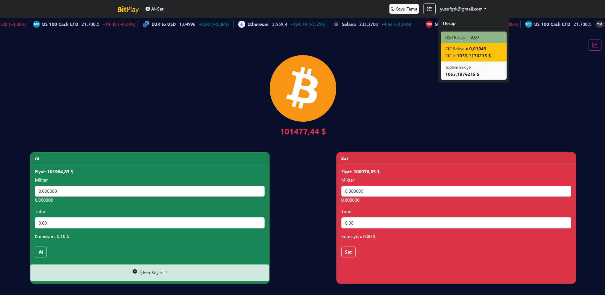
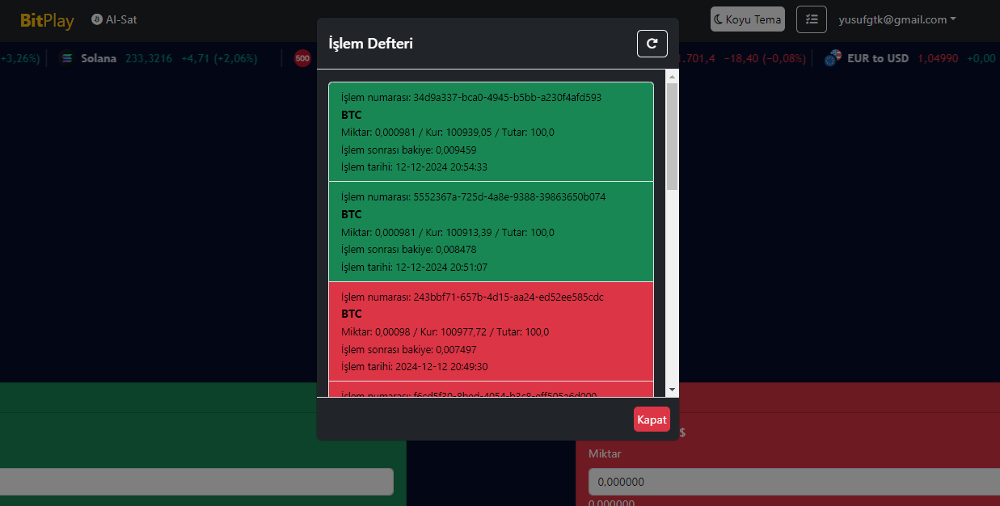

# BitPlay-.Net-9-Blazor-Wasm-Sanal-Kripto-Para-Borsası-Al-Sat-

BitPlay, kripto para işlemlerini kolayca yönetmek ve takip etmek için geliştirilmiş bir Blazor WebAssembly uygulamasıdır. Firebase entegrasyonu sayesinde güvenli kimlik doğrulama (authentication) ve gerçek zamanlı veri yönetimi sağlar.

## 🚀 Özellikler

- **Kimlik Doğrulama:** Firebase Authentication ile güvenli oturum açma ve kullanıcı yönetimi.
- **Gerçek Zamanlı Veri:** Firebase Firestore ile kullanıcıların işlemlerini gerçek zamanlı olarak görüntüleme.
- **Responsive Tasarım:** Tüm cihazlarda uyumlu, kullanıcı dostu bir arayüz.
- **İşlem Takibi:** Kripto para alım-satım işlemleri ve işlem geçmişi yönetimi.

